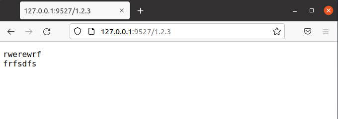
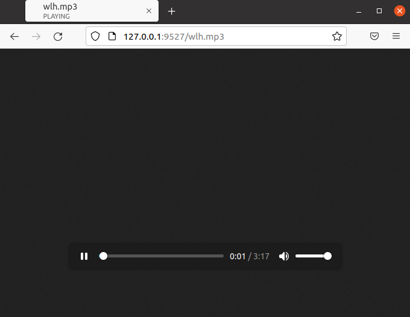

# epoll_http_server

### 1 项目目标

写一个浏览器用户访问服务器文件的WEB服务器

### 2 需求分析

（1）基于epoll的多路IO复用技术实现多用户访问；

（2）可以访问不同类型的文件；

（3）可以访问目录；

### 3 模块介绍

#### 3.1 tool头文件

文件夹的tool.h中声明了三个函数：16进制转化10进制、编码、解码。

这里的编码是指将汉字处理成unicode码，解码是其反过程。

16进制转换成10进制，hexit函数

```c++
int hexit(char c) {
	if (c >= '0' && c <= '9') {
		return c - '0';
	}
	if (c >= 'A' && c <= 'F') {
		return c - 'A' + 10;
	}
	if (c >= 'a' && c <= 'f') {
		return c - 'a' + 10;
	}
}
```

编码函数，encode_str函数

```c++
void encode_str(char* to, int tosize, const char* from){
	int tolen;

	for (tolen = 0; *from != '\0' && tolen + 4 < tosize; ++from) {    
		if (isalnum(*from) || strchr("/_.-~", *from) != (char*)0) {      
			*to = *from;
			++to;
			++tolen;
		} else {
			sprintf(to, "%%%02x", (int) *from & 0xff);
			to += 3;
			tolen += 3;
		}
	}
	*to = '\0';
}
```

解码函数，decode_str函数

```c++
void decode_str(char* to, char* from) {
	for ( ; *from != '\0'; ++to, ++from  ) {     
		if (from[0] == '%' && isxdigit(from[1]) && isxdigit(from[2])) {       
			*to = hexit(from[1])*16 + hexit(from[2]);
			from += 2;                      
		} else {
			*to = *from;
		}
	}
	*to = '\0';
}
```

#### 3.2 server文件

1、epoll_run函数
	功能：
	（1）创建epoll监听红黑树；
	（2）调用init_listen_fd函数；
	（3）只处理读事件，是连接请求，调用do_accept函数处理连接请求；是读数据请求，调用do_read函数处理。

读数据请求。

2、init_listen_fd函数
	功能：
	（1）创建监听文件描述符lfd；
	（2）设置端口复用、绑定地址结构、设置监听上限、创建epoll监听红黑树等操作；
	（3）将监听文件描述符添加到epoll红黑树上。

3、do_accept函数
	功能：
	（1）阻塞监听监听文件描述符lfd，得到通信文件描述符cfd；
	（2）将通信文件描述符设置成非阻塞方式，并添加到epoll红黑树上，将红黑树设置成边沿模式（默认是非阻塞

方式）。

4、do_read函数
	功能：
	（1）读取一行来自浏览器的http协议，调用http_request处理get请求，并将通信文件描述符从epoll红黑树上

del掉。

5、get_line函数
	功能：
	（1）获取一行 \r\n结尾的数据

6、http_request函数
	功能：
	（2）拆分http协议请求行，利用sscanf和正则表达式分成请求方法（GET）、路径（path）、协议

（protocol）
	（2）调用decode_str函数将路径解码成unicode码%23 %34 %5f
	（3）判断文件类型；
	（4）如果是普通文件，调用send_respond发送http应答协议头，并调用get_file_type判断文件类型，调用

send_file发送文件内容；
	（5）如果是目录文件，调用send_respond发送http应答协议头，并调用get_file_type判断文件类型，调用

send_dir发送文件内容；

7、send_respond函数
	功能：
	（1）发送头响应给浏览器，包括状态行、消息报头、空行

8、get_file_type函数
	功能：
	（1）判断文件类型，确定文件的打开方式

9、send_file函数
	功能：
	（1）打开服务器本地文件，将服务器本地文件发送给浏览器；打开失败，发送404页面给浏览器。

10、send_dir函数
	功能：
	（1）打开目录文件，显示当前目录下的文件（目录或者文件）；打开失败，发送404页面给浏览器。

11、send_error函数
	功能：
	（1）发送错误页面。

### 4 函数关系


本图只是方便展示流程，并不标准。

### 5 测试

编译

```
gcc tool.c server.c main.c -o server
```

运行

```
./server 9527 /home/winter/networkProject/epoll_http_server/dir/
```


提前在/home/winter/networkProject/epoll_http_server/dir/路径下存储一写文件

case 1:打开1.2.3文件



case 2:打开gif文件


case 3:打开mp3文件


